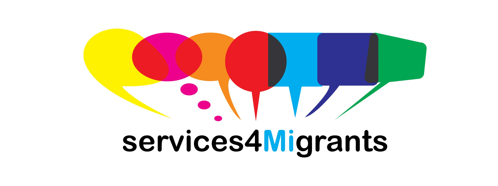
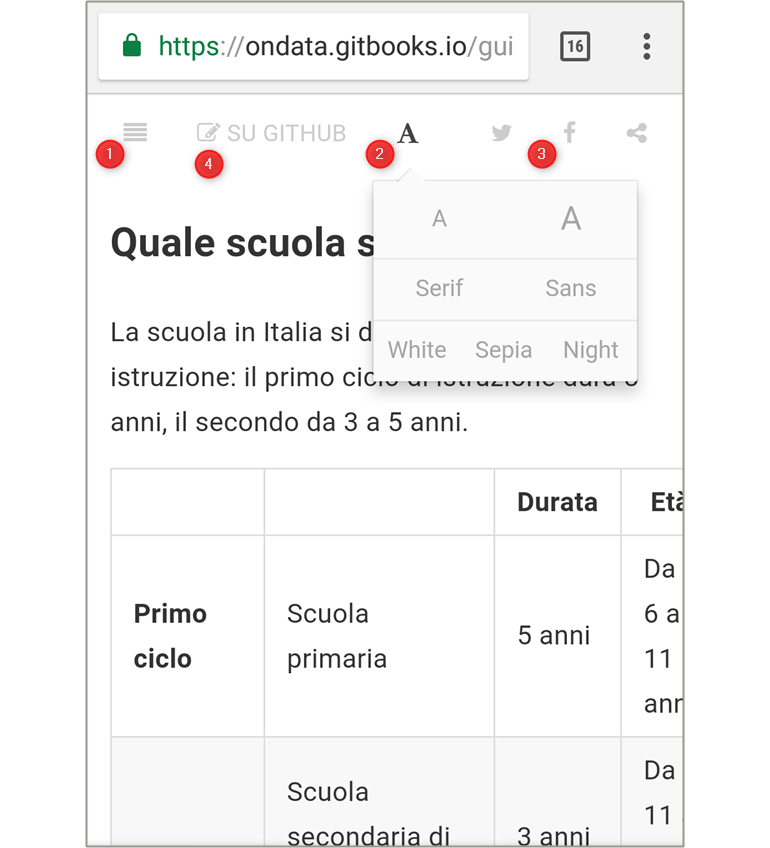

## La guida in versione ipertestuale

Il 10 e 11 marzo del 2018 [**onData**](http://ondata.it/) è stata *mentor* (con Andrea Borruso e Ilaria Vitellio) dell'*hackathon* [**Services4MIgrants**](https://www.eventbrite.it/e/biglietti-services4migrants-un-hackathon-per-migliorare-i-servizi-ai-migranti-43354522544), che aveva come obiettivo quello di rendere comprensibili e accessibili - attraverso l'ideazione di nuovi linguaggi, l'uso di dati aperti e le tecnologie informatiche - le complesse procedure burocratiche che i migranti devono affrontare per il "**ricongiungimento familiare**".

Il **Comune di Milano** ha realizzato la [**"Guida per il ricongiungimento familiare tra cittadini extra UE"**](assets/GUIDA_RICONGIUNGIMENTO_FAMILIARE_20_9_2016.pdf), rivolta ai tanti "mediatori" che danno supporto a chi deve affrontare queste pratiche. 
È un file in formato PDF composto da 16 pagine, pensato per essere stampato (come si evince dalle pagine bianche presenti, le "retrocopertine") e

È il riferimento a tema principale ed è stato molto usato dai partecipanti all'*hackathon*. 
Per questa ragione, in attesa di nuovi supporti informativi, è stato **trasformato** in un **documento ipertestuale**.

## Le caratteristiche principali di questa nuova versione

Questa le caratteristiche principali:

- ottimizzato per essere molto **leggibile**, sia *desktop* che da *smartphone*;
- un **indice ipertestuale** a scomparsa (vedi `1`);
- la possibilità di modificare **dimensioni** e **tipo** di ***font*** (vedi `2`);
- la possibilità di modificare **tema**, per scegliere versione per lettura notturna (vedi `2`);
- i tasti per la **condivisione** sui *social* (vedi `3`);
- l'opportunità di **lavorare in gruppo** per fare revisioni, correzioni e integrazioni sui testi, tramite un *repository* github (vedi `4`);
- un form per **ricerche di testo**;
- la possibilità di **condividere** e inviare l'hyperlink solo alla **porzione di interesse** e non l'intero testo (come si è costretti con il PDF);
- attivazione dei **link ipertestuali** anche sugli indirizzi **email** (nel PDF non lo sono);
- la possibilità di **raccogliere commenti** per le varie sezioni;
- l'**export** in **PDF** e in **ePub**.

*by [Associazione onData](http://ondata.it/)*

---

 Quest'opera è distribuita con Licenza <a rel="license" href="http://creativecommons.org/licenses/by/4.0/">Creative Commons Attribuzione 4.0 Internazionale</a>.